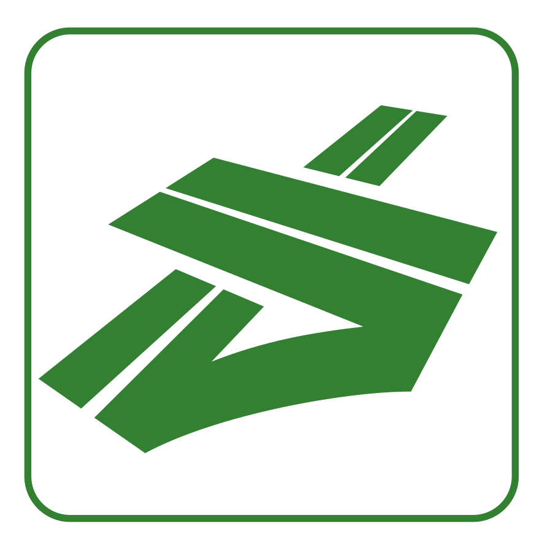

<html>
  <head>
    
  </head>
  
  
  <body>
    

      
      

             
Hi 👋🏻 I am a PhD student working with Dr. <a href="https://sites.gatech.edu/ce-trafficlab/">Jorge Laval</a> in the School of Civil and Environmental Engineering at the <a href="GT">Georgia Institute of Technology</a> 🐝. 

              
Under the specific focus on <a href="tags/Traffic-Flow" style="background-color: #6d8c7e;" class="badge badge-primary">Traffic-Flow</a>, my research interests include <a href="tags/Self-Driving" style="background-color: #6d8c7e;" class="badge badge-primary">Self-Driving</a>, <a href="tags/ACC" style="background-color: #6d8c7e;" class="badge badge-primary">ACC</a>, <a href="tags/Car-following" style="background-color: #6d8c7e;" class="badge badge-primary">Car-following</a>, and <a href="tags/MFD" style="background-color: #6d8c7e;" class="badge badge-primary">MFD</a>. Most recently, I am working on the critical phenomena of traffic flow. 

              
          
 
    

  </body>
</html>

 
 

<html>
  
<h4> News </h4>
<ul class="ul-edu fa-ul"> 
    <li> 
    <i class="fa-li fas fa-unicorn" style="color: #6d848c;"></i>
    

        
[Feb 2024] I was selected as a recipient of the 2024 CEE Future Faculty Fellowship 

    

   </li>
   <li> 
    <i class="fa-li fas fa-unicorn" style="color: #6d848c;"></i>
    

        
[Jan 2024] I was selected as a recipient of the 2024 Babs Abubakari Memorial Scholarship 

    

   </li>
  <li> 
    <i class="fa-li fas fa-unicorn" style="color: #6d848c;"></i>
    

        
[Sep 2023] The paper "A Global Search Problem on the Calibration of Two-regime Stochastic Car-following Model" was presented at the 26th IEEE International Conference on Intelligent Transportation Systems ITSC 2023

    

   </li>
    <li> 
    <i class="fa-li fas fa-unicorn" style="color: #6d848c;"></i>
    

        
[Jul 2023] The paper "Effects of Loop Detector Position on the Macroscopic Fundamental Diagram" was published in the Transporation Research Part C

    

   </li>
    <li> 
    <i class="fa-li fas fa-unicorn" style="color: #6d848c;"></i>
    

        
[May 2023] I started to serve as a Social Outreach Officer at ITE Georgia Tech Student Chapter!

    

   </li>

</ul>
  

<h4> Education </h4>
<ul class="ul-edu fa-ul"> 
    <li>
      <i class="fa-li fas fa-carrot" style="color: #6d8c7e;"></i>
      

        
Ph.D. in Civil and Environmental Engineering, (2021 ~ )

        
Georgia Institute of Technology

      

    </li>
    <li>
      <i class="fa-li fas fa-carrot" style="color: #6d8c7e;"></i>
      

        
M.S. in Computational Science and Engineering, (2023 ~ )

        
Georgia Institute of Technology

      

    </li>

   <li>
      <i class="fa-li fa fa-graduation-cap" style="color: #6d8c7e;"></i>
      

        
M.S. in Civil and Environmental Engineering, (2019 ~ 2021) 

        
Seoul National University, South Korea

      

    </li>
    <li>
      <i class="fa-li fa fa-graduation-cap" style="color: #6d8c7e;"></i>
      

        
B.S. in Civil and Environmental Engineering, (2015 ~ 2019) 

        
Seoul National University, South Korea

      

    </li>
</ul>
 

  
<h4> Awards & Scholarship & Fellowship </h4>  
<ul class="ul-edu fa-ul"> 
      <li>
      <i class="fa-li fas fa-award" style="color: #6d8c7e;"></i>
      

        
 2024 CEE Future Faculty Fellowship 

        
Georgia Tech, Feb 2024

      

    </li>
    <li>
      <i class="fa-li fas fa-award" style="color: #6d8c7e;"></i>
      

        
 2024 Babs Abubakari Memorial Scholarship 

        
 American Society of Highway Engineers (ASHE) - Georgia Section, Jan 2024

      

    </li>
    <li>
      <i class="fa-li fas fa-award" style="color: #6d8c7e;"></i>
      

        
 Next Generation Science & Technology Leader NET Grant 

        
The Korean Federation of Science and Technology Societies (KOFST), May 2023 - Dec 2023

      

    </li>
    <li>
      <i class="fa-li fas fa-award" style="color: #6d8c7e;"></i>
      

        
D. J. Altobelli Fellowship 

        
Georgia Institute of Technology, Aug. 2021

      

    </li>

    <li>
      <i class="fa-li fas fa-award" style="color: #6d8c7e;"></i>
      

        
External Advisory Board Fellowship 

        
Georgia Institute of Technology, Aug. 2021

      

    </li>
      <li>
      <i class="fa-li fas fa-medal" style="color: #6d8c7e;"></i>
      

        
Best Paper Award 

        
Korean Transportation Association in America (KOTAA) 2021 Annual meeting, Jan. 2021

      

    </li>
  
    <li>
      <i class="fa-li fa fa-award" style="color: #6d8c7e;"></i>
      

        
 Brain Korea 21 Scholarship 

        
Mar. 2019 - Feb. 2021

      

    </li>

    <li>
      <i class="fa-li fas fa-medal" style="color: #6d8c7e;"></i>
      

        
 Outstanding Undergraduate Dissertation Award (2nd Prize) 

        
Department of Civil and Environmental Engineering, Seoul National University, Dec. 2018

      

    </li> 
  
    <li>
      <i class="fa-li fas fa-medal" style="color: #6d8c7e;"></i>
      

        
 Civil Structure Model Competition Award (Grand Prize)

        
Korean Society of Civil Engineering, Mar. 2017

      

    </li> 

      <li>
      <i class="fa-li fa fa-award" style="color: #6d8c7e;"></i>
      

        
 Merit-based Scholarship 

        
 - Second and Third Semester of Graduate School 

        
 - Fourth, Fifth, and Seventh Semester of Undergraduate School 

        
Seoul National University, South Korea

      

    </li>
</ul>  
  
 
<h4> Teaching Experiences</h4> 
<ul class="ul-edu fa-ul"> 
    <li>
      <i class="fa-li fas fa-pencil" style="color: #6d8c7e;"></i>
      

        
Teaching Assistant, Georgia Institute of Technology 

        
CEE6632 Simulation in Transport, Spring 2024

        
CEE3770 Statistics and Applications, Fall 2023

        
CEE3770 Statistics and Applications, Fall 2022

        
CEE3770 Statistics and Applications, Fall 2021

      

    </li>

    <li>
      <i class="fa-li fas fa-pencil" style="color: #6d8c7e;"></i>
      

        
Teaching Assistant, Seoul National University 

        
Transportation Optimization Techniques, Spring 2020

        
Transportation Planning and Laboratory, Spring 2020

        
Traffic Engineering and Laboratory, Fall 2019

      

    </li>
  </ul>  
  
 
<h4> Extracurricular</h4> 
<ul class="ul-edu fa-ul"> 
    <li>
      <i class="fa-li fas fa-hand-holding-heart" style="color: #6d8c7e;"></i>
      

        
<a href="https://ite.ce.gatech.edu/">ITE@GT (Georgia Tech Student Chapter of the Institute of Transportation Engineers)</a> 

        
Social Outreach Director 2023-2025

      

    </li>
    <li>
      <i class="fa-li fas fa-hand-holding-heart" style="color: #6d8c7e;"></i>
      

        
Georgia Tech Civil and Environmental Engineering Korean Student Association (GTCEEKSA)

        
President 2022-2023

      

    </li>

    <li>
      <i class="fa-li fas fa-hand-holding-heart" style="color: #6d8c7e;"></i>
      

        
Student Council of the College of Engineering, Seoul National University 

        
Director of Public Relations Bureau

      

    </li>
  
      <li>
      <i class="fa-li fas fa-hand-holding-water" style="color: #6d8c7e;"></i>
      

        
Volunteer Works 

        
1. Water-Purification-System Construction Project in Phuoc Loc Elementary School, Vietnam

        
Undergraduate Construction Engineer and Site Manager, <em>SNU Social Responsibility</em>

        
2. Philippines Sustainable Water Circulation Project

        
Undergraduate Researcher, <em>Hyundai Motor Company CSR Project</em>

      

    </li>
  </ul>    
  
 
<h4> Skills </h4> 

 

   <i class="fab fa-python fa-3x" style="color: #f9e487;"></i>
   
Python 

  

  
   

  <i class="fas fa-registered fa-3x" style="color: #89E3F7;"></i>
   
R 

  

  
  

   
   
Mathematica 

  

  
  

  
   

   
   
SUMO 

  

  
   

   
   
ArcGis Pro 

  

  
 

   

   
   
Illustrator 

  

  
  

   
   
Photoshop 

  

  
  

   
   
InDesign 

  

</html>

<!-- Google tag (gtag.js) -->

